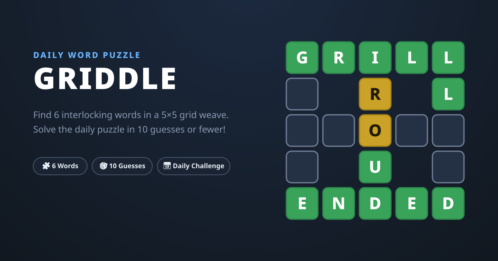

# Griddle



**Griddle** is a daily word puzzle. Six five-letter words — three across, three
down — are woven together into a 5×5 grid, sharing nine intersections. Find
them all within **10 guesses**.

## How to play

- Enter any valid five-letter word. Every guess is scored against all six
  hidden words at the same time.
- 🟩 **Green** — the letter is correct in that square, and locks in.
- 🟨 **Yellow** — the letter belongs to one of the words crossing that square,
  but in a different position. (Yellow hints belong to the selected guess —
  tap a guess number to compare.)
- ⬛ **Gray** — the letter appears in none of the words crossing that square.
- A duplicated letter is matched only as many times as it appears in each
  answer word.
- Finish with guesses to spare and each leftover becomes a ⭐.

## Share

Results copy as emoji, ready to paste anywhere:

```
Griddle 123 6/10
🟩 🟩 🟩 🟩 🟩
🟩 ⭐ 🟩 ⭐ 🟩
🟩 🟩 🟩 🟩 🟩
🟩 ⭐ 🟩 ⭐ 🟩
🟩 🟩 🟩 🟩 🟩
```

## Development

```bash
npm install
npm run dev    # start the dev server
npm run test   # run the test suite
npm run build  # type-check + production build into dist/
```

- Puzzles live in `src/puzzles.ts` — generate more with
  `node scripts/generate-h0-diverse.cjs <count>`.
- The guess dictionary is generated into `src/words.ts` via
  `npm run update-words`.

## License

MIT — see [LICENSE](LICENSE).
